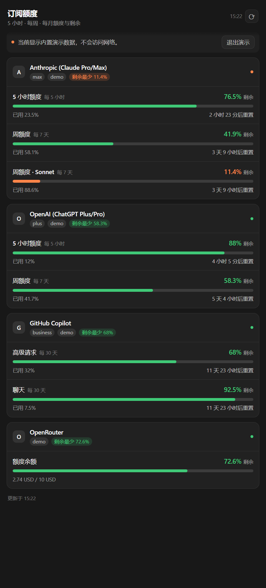

# 订阅额度 · Subscription Quotas

> 在 PI-Desktop 右侧工作面板里，一眼看清你的 AI 订阅还剩多少额度。
> 支持 Anthropic (Claude Pro/Max)、OpenAI (ChatGPT Plus/Pro)、GitHub Copilot、OpenRouter，
> 以及 Kimi Code / Meta / Radius / xAI 的自定义来源。**只显示本机已登录的账号。**



*（上图是内置演示数据，用于展示界面；真实使用时按你的账号渲染。）*

---

## 功能

- **按周期展示额度**：5 小时窗口、周额度、月额度、余额，各带独立进度条。
- **剩余为核心**：进度条 **绿色填充 = 剩余额度**，灰色底槽 = 已用掉的额度；
  右侧大号数字是剩余百分比，颜色随剩余风险变化（>30% 绿、10–30% 橙、<10% 红）。
- **重置倒计时**：每秒刷新，30 分钟内变橙。
- **只显示已登录的**：拿不到凭据的服务商不会出现在列表里，不占位、不报错。
- **跟随应用外观**：深浅色、语言与 PI-Desktop 设计令牌一致。
- **零配置可用**：已登录的 Claude Code / Codex / Copilot 会被自动发现。

## 支持的服务商

厂商 id 与 PI-Desktop「用订阅登录」列表一致。

| 服务商 | 厂商 id | 凭据来源 | 额度接口 | 窗口 |
|---|---|---|---|---|
| Anthropic (Claude Pro/Max) | `anthropic` | Claude Code 凭据文件 / 手工令牌 | `api.anthropic.com/api/oauth/usage` | 5 小时 · 周（全部 / Sonnet / Opus） |
| OpenAI (ChatGPT Plus/Pro) | `openai-codex` | Codex CLI 凭据文件 / 手工令牌 | `chatgpt.com/backend-api/wham/usage` | 5 小时 · 周 |
| GitHub Copilot | `github-copilot` | Copilot 编辑器凭据 / 手工令牌 | `api.github.com/copilot_internal/user` | 月（高级请求 / 聊天 / 补全） |
| OpenRouter | `openrouter` | 手工令牌 | `openrouter.ai/api/v1/key` | 余额 |
| Kimi Code (subscription) | `kimi-coding` | 手工令牌 + 自定义来源 | 需自行配置 | 取决于接口 |
| Meta (Muse subscription) | `meta` | 手工令牌 + 自定义来源 | 需自行配置 | 取决于接口 |
| Radius | `radius` | 手工令牌 + 自定义来源 | 需自行配置 | 取决于接口 |
| xAI (Grok/X subscription) | `xai` | 手工令牌 + 自定义来源 | 需自行配置 | 取决于接口 |

后四种没有公开的额度接口，配一次「自定义来源」即可显示，无需改代码：

```json
[
  {
    "vendor": "xai",
    "label": "xAI (Grok/X)",
    "url": "https://api.x.ai/v1/<你的额度接口>",
    "token": "你的令牌",
    "windows": [
      { "path": "rate_limits", "period": "week", "usedField": "used_percent",
        "resetField": "reset_at", "minutesField": "window_minutes" }
    ]
  }
]
```

省略 `windows` 时插件会**自动识别**这些常见字段名：
`used_percent` / `usedPercent` / `utilization` / `percent_remaining`、
`window_minutes` / `limit_window_seconds`、`reset_at` / `resets_in_seconds` / `reset_after_seconds`，
并从键名猜测周期（`five_hour` → 5 小时，`seven_day` → 周，`month` → 月）。

## 安装

需要 PI-Desktop。三种方式任选：

**方式一 · 插件市场（推荐）**

1. PI-Desktop → **插件** → **市场**。
2. 搜索「订阅额度」，或直接打开
   [plugins.aiuo.net/plugins/io.github.czp0312.subscription-quota](https://plugins.aiuo.net/plugins/io.github.czp0312.subscription-quota)。
3. 安装时审阅权限并授权（`net.fetch` 属高风险权限）。

插件 id 是 `io.github.czp0312.subscription-quota`，市场条目与源码 tag `v0.2.0`
一一对应（目录里记录 sha256，客户端安装前会校验）。

**方式二 · 安装插件包**

1. 打开 **插件**（扩展）页。
2. 右上角溢出菜单 → **安装插件包**。
3. 选择 `io.github.czp0312.subscription-quota-<版本>.piplug`。
4. 审阅权限后安装（`net.fetch` 属高风险权限，需你显式授权）。

插件包从本仓库的 [Releases](../../releases) 下载，或按下方「打包」一节自行构建。

**方式三 · 加载开发插件**

1. 插件页 → **加载开发插件**。
2. 选择本仓库根目录（含 `manifest.json` 的那一层）。
3. 之后改动会热重载；**新增/放宽权限需要重新加载目录**。

装好后：右侧工作面板的视图菜单里会出现 **订阅额度**；
命令面板（`Ctrl+K`）执行 **Subscription Quotas: Open Panel** 可打开独立面板窗口。

## ⚠️ 关于「登录」的一个边界（重要）

PI-Desktop 的「用订阅登录」把 OAuth 凭据**加密保存在宿主的密钥库里**
（host-core SecretStore：`<dataDir>/secrets/<sha256(ref)>.bin`，AES-256-GCM，
机器密钥在 `<dataDir>/secrets/.machine-key`），插件 API 不暴露它，宿主也没有任何额度/用量接口。

插件进程虽然有原生 Node 能力，但读取机器密钥再解密密钥库等于**绕过宿主刻意建立的凭据隔离**，
本插件**不会**这样做。因此：

> **只在 PI-Desktop 设置里登录过的账号，本插件读不到它的额度。**

本插件能用的凭据只有两类：

1. 你在**本插件的设置**里填写的令牌（`credentials` / `sources`）；
2. 本机**已经登录的 CLI / 编辑器**留下的凭据文件（见下表）。

所以在本插件里，「已登录」＝「本机能拿到这个账号的可用凭据」。

## 凭据发现路径

| 服务商 | 查找的文件 |
|---|---|
| `anthropic` | `$CLAUDE_CONFIG_DIR/.credentials.json`、`~/.claude/.credentials.json` |
| `openai-codex` | `~/.codex/auth.json`（`tokens.access_token` + `tokens.account_id`） |
| `github-copilot` | `~/.config/github-copilot/hosts.json`、`…/apps.json`、`%APPDATA%\github-copilot\hosts.json`、`%LOCALAPPDATA%\github-copilot\hosts.json` |
| 其余 | 无可发现路径，只认手工令牌 |

只读取上表这些明确路径，不遍历目录、不读取其它文件。关掉设置里的「自动发现」即可完全不读它们。

## 设置

设置 → 扩展 → 订阅额度：

| 键 | 类型 | 默认 | 说明 |
|---|---|---|---|
| `autoDetect` | boolean | `true` | 自动发现本机已登录的账号（上面的凭据文件） |
| `demoMode` | boolean | `false` | 只渲染内置演示数据，不访问网络 |
| `refreshSeconds` | number | `300` | 轮询间隔（30–3600 秒） |
| `credentials` | json | `{}` | `厂商 id → 令牌`，填了即视为已登录 |
| `sources` | json | `[]` | 自定义额度来源（见上） |
| `accounts` | json | `[]` | 完全手填的窗口，不联网 |

手工令牌示例：

```json
{
  "openrouter": "sk-or-v1-...",
  "anthropic": "...",
  "openai-codex": "...",
  "github-copilot": "ghu_..."
}
```

完全手填的窗口示例（不联网）：

```json
[
  {
    "id": "my-relay",
    "label": "自建中转",
    "plan": "team",
    "windows": [
      { "period": "session", "used": 12, "limit": 60, "unit": "次", "resetsAt": "2026-01-01T12:00:00Z" },
      { "period": "week", "label": "本周额度", "usedPercent": 42.5 },
      { "period": "month", "used": 980, "limit": 5000, "unit": "请求" }
    ]
  }
]
```

`period` 取 `session` / `day` / `week` / `month` / `credit`；
额度可写 `usedPercent`，或 `used` + `limit`（自动换算百分比）；`resetsAt` 支持 ISO 字符串。

## 权限与安全

| 权限 | 用途 |
|---|---|
| `ui.view` | 工作面板停靠视图 |
| `ui.panel` | 命令打开独立面板窗口 |
| `net.fetch` | 请求额度接口（高风险，安装时需显式授权） |

`net.domains` 只声明八个服务商域名：`api.anthropic.com`、`chatgpt.com`、`api.github.com`、
`openrouter.ai`、`api.kimi.com`、`api.meta.ai`、`radius.pi.dev`、`api.x.ai`。
自定义来源同样受这份白名单约束 —— 填非白名单地址会被宿主拒绝。

- 令牌不写日志、不进缓存、不出现在返回给界面的任何字段里；缓存只保存额度数字。
- 插件不读取 PI-Desktop 的密钥库，也不碰 `~/.ssh`、`.env*`、`*.pem` 等凭据路径。
- 本插件不提供系统级通知、不注册常驻服务、不注入 Agent 提示词。

## 从源码校验与打包

需要 PI-Desktop 仓库检出（devkit 目前是仓库内私有包）：

```bash
pnpm install
pnpm --filter @pi-desktop/plugin-devkit... build
pnpm pi-plugin check <本仓库路径>
pnpm pi-plugin pack  <本仓库路径>
# → dist/io.github.czp0312.subscription-quota-0.2.0.piplug
```

生成的 `.piplug` 是 store-only ZIP，请勿用普通 `zip` 重打（安装器只接受未压缩归档）。
`dist/` 已加入 `.gitignore`，发布时把 `.piplug` 挂到对应的 GitHub Release 上。

## 目录结构

```
.
├── manifest.json      # 插件身份、贡献点、权限、域名白名单
├── main.js            # 插件进程：服务商注册表、凭据发现、额度归一化、通道路由
├── views/quota.html   # 视图 / 面板共用的界面（无构建步骤）
├── assets/preview.png # 本 README 的界面预览图
├── README.md
├── CHANGELOG.md
└── LICENSE
```

`views/quota.html` 在 PI-Desktop 之外直接打开会进入「独立预览」模式：
检测不到 `window.pluginBridge` 时渲染内置演示数据，方便调样式。

## 已知限制

- 上游额度接口都是服务商私有接口，非公开契约；结构变化时界面会显示失败原因，而不会静默给出错误数字。
- Kimi Code / Meta / Radius / xAI 没有公开的额度接口，需要你在 `sources` 里配一次。
- OpenRouter 只对**设了 limit 的密钥**给出剩余比例；没设上限时只提示、不显示数字。
- 只在 PI-Desktop 里登录（未在对应 CLI 登录、也未填令牌）的账号不会显示 —— 见上面的边界说明。
- OAuth 令牌过期不会自动刷新，请重新登录对应 CLI 或换填新令牌。
- 依赖 `net.anyHost` 的自建中转站地址在当前稳定版宿主上不可用（该权限尚未进入发布版本）。

## 更新日志

见 [CHANGELOG.md](CHANGELOG.md)。

## 许可

[MIT](LICENSE)
